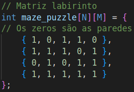
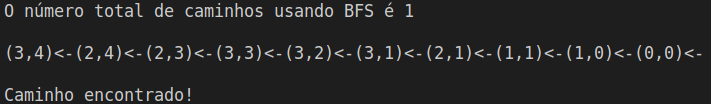

# Labirinto-BFS-DFS

<div style="display: inline-block;">

 
</a> 
</div>

<p> </p>
<p> </p>

## Grupo
- Celso Vinícius S. F.
- Pedro H. Pires Dias

## Abstract

Elabore um pequeno programa que utilize uma matriz N x N, com o valor de N fornecido como entrada do programa, o jogo deve ser elaborado utilizando um arquivo de configuração para executar as seguintes operações:
- Tamanho da matriz; 
- Posições de paredes; 
- Tipo de busca;
- O jogo termina assim que for atingido o alvo;
- É preciso imprimir o caminho em tela sob uma representação de matriz. Então, imprima conforme exercício de matriz já realizado.

<!--
Perguntas:
- Para diferentes tamanhos de matriz e posicionamento de paredes, há predominância de um dos dois algorismos em termos de casas caminhadas e tempo de execução?
- Um dos dois algoritmos consegue encontrar o melhor caminho, ou seja, o com menor número de passos?
-->

<p align="center">
	 
</p>

## Estrutura BFS Search
<p align="justify">
Basicamente, para a estrutura Breadth-First Traversal (BFS) começa-se com o nó e colocamos na fila, posteriormente repete-se as etapas a seguir para todos os nós na matriz. Desenfileirar e processá-lo, enfileirar todos os nós adjacentes e processá-los. Sendo (0,0) o nó inicial, primeiro, nós o enfileiramos na fila visitada e todos os seus nós adjacentes na fila. Em seguida, pegamos um dos nós adjacentes para processar, ou seja, 1. Marcamos como visitado removendo-o da fila e colocando seus nós subsequentes na fila, ignorando os nós já visitados.
</p>

```c
int BFS_Search(int mazes[N][M]){
    queue<pair<int, int> > queues;
    // Definindo inicialmente i e j em (0, 0).
    queues.push(make_pair(0, 0));
    // Contando o número total possível de caminhos
    int count = 0;
    while (!queues.empty()) {
        pair<int, int> p = queues.front();
        queues.pop();

        // Incrementando. o destino consiste em vários caminhos
        if (p.first == N - 1 && p.second == M - 1)
            count++;
        if (p.first + 1 < N && mazes[p.first + 1][p.second] == 1){
            queues.push(make_pair(p.first + 1, p.second));
        }
        if (p.second + 1 < M && mazes[p.first][p.second + 1] == 1){
            queues.push(make_pair(p.first, p.second + 1));
        }
    }

    return count;
}           
```

## Método IsReaching
<p align="justify">
Nesse método primeiro definimos i e j nas posições (0,0). Em seguida, no while, utilizamos a pilha, que nesse momento ainda estava vazia, para dar início ao processo de empilhamento, sempre empurrando o node para a pilha novamente. Chegando ao ponto final, o programa retorna true. Sempre que a pilha for visitada, retira o node da pilha. 
</p>

```c
bool IsReaching(int maze[N][M],int a1,int a2,bool visited[N][M]){
    // Definindo inicialmente i e j em (0, 0).
    int i = 0, j = 0;
    stack<Node> stacks;
    Node temporary(i, j);
    stacks.push(temporary);

    while (!stacks.empty()){

        temporary = stacks.top();
        int d = temporary.dir;
        i = temporary.x, j = temporary.y;

        // empurrando o node na pilha novamente.
        temporary.dir++;
        stacks.pop();
        stacks.push(temporary);

        // Se chegarmos ao ponto final retorna true
        if (i == a1 and j == a2)
        {
            //imprimindo as coordenadas
            while (!stacks.empty()){
                Node temporary1 = stacks.top();
                cout << "(" << temporary1.x << "," << temporary1.y << ")->";
                stacks.pop();
            }
            cout << endl << endl;
            return true;
        }

        if (d == 0){
            if (i - 1 >= 0 and maze[i - 1][j] and visited[i - 1][j]){
                Node temp1(i - 1, j);
                visited[i - 1][j] = false;
                stacks.push(temp1);
            }
        }

        else if (d == 1){
            if (j - 1 >= 0 and maze[i][j - 1] and visited[i][j - 1]){
                Node temp1(i, j - 1);
                visited[i][j - 1] = false;
                stacks.push(temp1);
            }
        }
        else if (d == 2){
            if (i + 1 < N and maze[i + 1][j] and visited[i + 1][j]){
                Node temp1(i + 1, j);
                visited[i + 1][j] = false;
                stacks.push(temp1);
            }
        }
        else if (d == 3){
            if (j + 1 < M and maze[i][j + 1] and visited[i][j + 1]){
                Node temp1(i, j + 1);
                visited[i][j + 1] = false;
                stacks.push(temp1);
            }
        }

        // se for visitado então retira o node
        else{
            visited[temporary.x][temporary.y] = true;
            stacks.pop();
        }
    }
    return false;
}         
```

## Funcionamento do programa

<p align="justify">	
	Aqui o usuário escolhe onde ficarão as paredes da matriz, inserindo com zeros (0) onde desejar.
</p>
<p align="center">
 
</p>
	
<p align="justify">	
	Funcionamento básico no terminal.
</p>
	
<p align="center">
 
</p>

## Compilação e Execução

O código disponibilizado possui um arquivo Makefile que realiza todo o procedimento de compilação e execução. Para tanto, temos as seguintes diretrizes de execução:


| Comando                |  Função                                                                                           |                     
| -----------------------| ------------------------------------------------------------------------------------------------- |
|  `make clean`          | Apaga a última compilação realizada contida na pasta build                                        |
|  `make`                | Executa a compilação do programa utilizando o gcc, e o resultado vai para a pasta build           |
|  `make run`            | Executa o programa da pasta build após a realização da compilação                                 |


