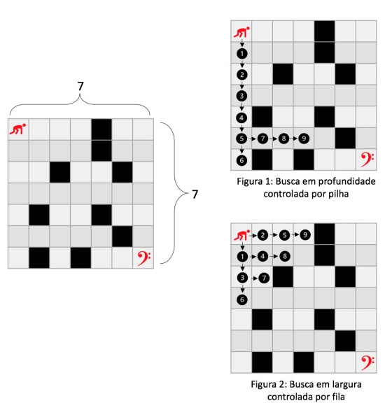

# Labirinto-BFS-DFS

<div style="display: inline-block;">

 
</a> 
</div>

<p> </p>
<p> </p>

## Abstract

Elabore um pequeno programa que utilize uma matriz N x N, com o valor de N fornecido como entrada do programa, o jogo deve ser elaborado utilizando um arquivo de configuração para executar as seguintes operações:
- A) tamanho da matriz; 
- B) posições de paredes; 
- C) tipo de busca.
- O jogo termina assim que for atingido o alvo. 
- É preciso imprimir o caminho em tela sob uma representação de matriz. Então, imprima conforme exercício de matriz já realizado.

Perguntas:
- Para diferentes tamanhos de matriz e posicionamento de paredes, há predominância de um dos dois algorismos em termos de casas caminhadas e tempo de execução?
- Um dos dois algoritmos consegue encontrar o melhor caminho, ou seja, o com menor número de passos?


<p align="center">
	 
</p>

## BFS
<p align="justify">
Para a estrutura BFS usamos essa POHA AÍ EMBAIXO: 
	ps: nao sei explicar oq eu fiz
</p>

```c
int BFS_Search(int mazes[N][M]){
    queue<pair<int, int> > queues;
    // Definindo inicialmente i e j em (0, 0).
    queues.push(make_pair(0, 0));
    // Contando o número total possível de caminhos
    int count = 0;
    while (!queues.empty()) {
        pair<int, int> p = queues.front();
        queues.pop();

        // Incrementando. o destino consiste em vários caminhos
        if (p.first == N - 1 && p.second == M - 1)
            count++;
        if (p.first + 1 < N && mazes[p.first + 1][p.second] == 1){
            queues.push(make_pair(p.first + 1, p.second));
        }
        if (p.second + 1 < M && mazes[p.first][p.second + 1] == 1){
            queues.push(make_pair(p.first, p.second + 1));
        }
    }

    return count;
}           
```
